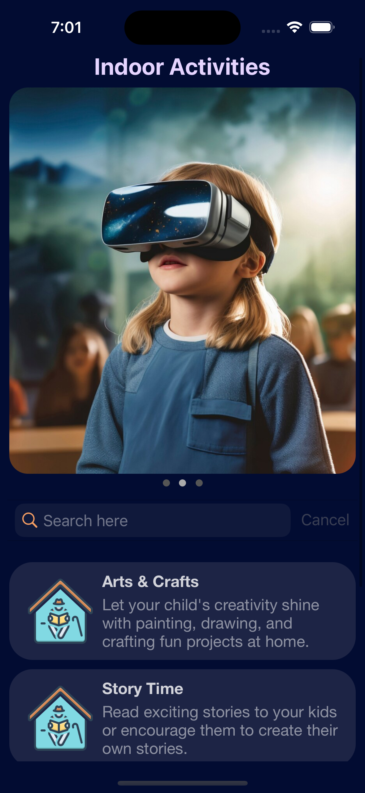

# AllInOneCollection

AllInOneCollection is an iOS app project that demonstrates how to implement a complex layout using a single `UICollectionView` with a compositional layout. This project showcases the power of compositional layouts by combining a **carousel**, **header**, **footer**, and **list** into a single, scrollable collection view.

## Features

- **Unified Layout**: All components (carousel, header, footer, list) are elegantly displayed within a single `UICollectionView`, avoiding the need for multiple views.
- **Compositional Layout**: Utilizes Apple's `UICollectionViewCompositionalLayout` to create dynamic and flexible layouts, perfect for modern app designs.
- **Carousel Section**: A horizontally scrolling carousel section allows for smooth and interactive scrolling experiences for your users.
- **Header and Footer**: Custom header and footer sections provide a structured layout for the app, giving it a professional look.
- **List Section**: Below the carousel, you'll find a list section to display detailed content in a structured format.
- **Highly Customizable**: The layout is designed to be easily extendable, allowing you to add or modify sections (e.g., add more items to the list or customize the carousel).

## Highlights

- **Single UICollectionView**: No need to manage multiple collection views; everything is handled within a single collection view using sections and item configurations.
- **Efficient Rendering**: The compositional layout ensures smooth scrolling and efficient rendering, even with complex UI setups.
- **Flexible Data Models**: Uses a clean, modular data model to dynamically manage the number of sections, carousel items, and list items, allowing easy updates and maintenance.

## Technologies Used

- **Swift**: The core language used for all the code.
- **UIKit**: Used for building the `UICollectionView` and managing layouts.
- **UICollectionViewCompositionalLayout**: The heart of the layout management, enabling the flexible and dynamic design.

## Installation

1. Clone the repository:
   ```bash
   git clone https://github.com/your-username/AllInOneCollection.git

      

https://github.com/user-attachments/assets/3e28be83-c57a-4498-828d-5b9691e324a0


